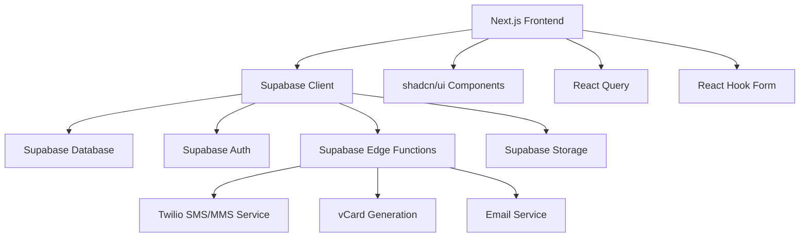

# Design Document

## Overview

The Shared Contact Groups application is a web-based platform built with TypeScript React that enables event hosts to create managed contact lists where participants can opt-in to share their information. The system uses Supabase for backend services (database, authentication, real-time subscriptions) and shadcn/ui for consistent, accessible UI components.

## Architecture

### Tech Stack
- **Frontend**: TypeScript React with Next.js 14 (App Router)
- **Backend**: Supabase (PostgreSQL database, Auth, Edge Functions, Storage)
- **UI Components**: shadcn/ui with Tailwind CSS
- **State Management**: React Query (TanStack Query) for server state
- **Form Handling**: React Hook Form with Zod validation
- **Authentication**: Supabase Auth with 2FA (SMS via Twilio)
- **Notifications**: Supabase real-time subscriptions + Twilio MMS/SMS + React Toast
- **SMS/MMS Service**: Twilio (A2P 10DLC or toll-free number)

### High-Level Architecture



## Components and Interfaces

### Core React Components

#### Layout Components
- `AppLayout` - Main application shell with navigation
- `AuthLayout` - Authentication pages wrapper
- `EmbedLayout` - Minimal layout for embedded forms

#### Feature Components
- `GroupCreationForm` - Create new contact groups
- `GroupDashboard` - Host view of group management
- `ContactForm` - Participant contact submission form
- `MemberList` - Display group members with contact info
- `EmbedGenerator` - Generate embed codes for external sites
- `ContactExport` - Download contacts in vCard format
- `NotificationSettings` - Manage SMS/MMS notification preferences
- `AuthForm` - Shop-style login/signup with 2FA
- `TwoFactorSetup` - SMS-based 2FA configuration
- `PhoneVerification` - Phone number verification component

#### UI Components (shadcn/ui)
- `Button`, `Input`, `Textarea` - Form controls
- `Card`, `Dialog`, `Sheet` - Layout containers
- `Table`, `Badge`, `Avatar` - Data display
- `Toast`, `Alert` - Notifications and feedback
- `Switch`, `Checkbox` - Settings controls

### API Layer

#### Supabase Client Configuration
```typescript
interface SupabaseClient {
  auth: AuthClient
  from: <T>(table: string) => QueryBuilder<T>
  rpc: (fn: string, params?: object) => Promise<any>
  storage: StorageClient
  channel: (name: string) => RealtimeChannel
}
```

#### Custom Hooks
- `useAuth()` - Authentication state and methods with 2FA support
- `useGroups()` - Fetch user's groups
- `useGroupMembers(groupId)` - Real-time group membership
- `useContactExport(groupId)` - Generate and download contacts
- `useNotifications()` - Manage SMS/MMS notification preferences
- `useTwoFactor()` - 2FA setup and verification
- `usePhoneVerification()` - Phone number verification flow
- `useSMSNotifications()` - Twilio SMS/MMS integration

## Data Models

### Database Schema (Supabase PostgreSQL)

```sql
-- Users table (extends Supabase auth.users)
CREATE TABLE profiles (
  id UUID REFERENCES auth.users PRIMARY KEY,
  email TEXT NOT NULL,
  full_name TEXT,
  phone TEXT,
  phone_verified BOOLEAN DEFAULT FALSE,
  two_factor_enabled BOOLEAN DEFAULT FALSE,
  sms_notifications_enabled BOOLEAN DEFAULT TRUE,
  created_at TIMESTAMP WITH TIME ZONE DEFAULT NOW(),
  updated_at TIMESTAMP WITH TIME ZONE DEFAULT NOW()
);

-- Contact Groups
CREATE TABLE contact_groups (
  id UUID PRIMARY KEY DEFAULT gen_random_uuid(),
  name TEXT NOT NULL,
  description TEXT,
  owner_id UUID REFERENCES profiles(id) NOT NULL,
  is_closed BOOLEAN DEFAULT FALSE,
  share_token TEXT UNIQUE NOT NULL DEFAULT encode(gen_random_bytes(16), 'hex'),
  created_at TIMESTAMP WITH TIME ZONE DEFAULT NOW(),
  updated_at TIMESTAMP WITH TIME ZONE DEFAULT NOW()
);

-- Group Memberships
CREATE TABLE group_memberships (
  id UUID PRIMARY KEY DEFAULT gen_random_uuid(),
  group_id UUID REFERENCES contact_groups(id) ON DELETE CASCADE,
  user_id UUID REFERENCES profiles(id) ON DELETE CASCADE,
  full_name TEXT NOT NULL,
  email TEXT NOT NULL,
  phone TEXT,
  notifications_enabled BOOLEAN DEFAULT FALSE,
  joined_at TIMESTAMP WITH TIME ZONE DEFAULT NOW(),
  UNIQUE(group_id, user_id)
);

-- Notification Events
CREATE TABLE notification_events (
  id UUID PRIMARY KEY DEFAULT gen_random_uuid(),
  group_id UUID REFERENCES contact_groups(id) ON DELETE CASCADE,
  event_type TEXT NOT NULL, -- 'member_joined', 'member_left', 'group_closed'
  data JSONB,
  created_at TIMESTAMP WITH TIME ZONE DEFAULT NOW()
);

-- SMS Notification Log
CREATE TABLE sms_notifications (
  id UUID PRIMARY KEY DEFAULT gen_random_uuid(),
  recipient_phone TEXT NOT NULL,
  message_type TEXT NOT NULL, -- 'group_closed', 'member_notification', '2fa_code'
  twilio_sid TEXT,
  status TEXT DEFAULT 'pending', -- 'pending', 'sent', 'delivered', 'failed'
  group_id UUID REFERENCES contact_groups(id) ON DELETE SET NULL,
  sent_at TIMESTAMP WITH TIME ZONE DEFAULT NOW()
);
```

### TypeScript Interfaces

```typescript
interface Profile {
  id: string
  email: string
  full_name?: string
  phone?: string
  phone_verified: boolean
  two_factor_enabled: boolean
  sms_notifications_enabled: boolean
  created_at: string
  updated_at: string
}

interface ContactGroup {
  id: string
  name: string
  description?: string
  owner_id: string
  is_closed: boolean
  share_token: string
  created_at: string
  updated_at: string
  owner?: Profile
  member_count?: number
}

interface GroupMembership {
  id: string
  group_id: string
  user_id?: string
  full_name: string
  email: string
  phone?: string
  notifications_enabled: boolean
  joined_at: string
  group?: ContactGroup
}

interface NotificationEvent {
  id: string
  group_id: string
  event_type: 'member_joined' | 'member_left' | 'group_closed'
  data: Record<string, any>
  created_at: string
}

interface SMSNotification {
  id: string
  recipient_phone: string
  message_type: 'group_closed' | 'member_notification' | '2fa_code'
  twilio_sid?: string
  status: 'pending' | 'sent' | 'delivered' | 'failed'
  group_id?: string
  sent_at: string
}
```

## Error Handling

### Client-Side Error Handling
- **Form Validation**: Zod schemas with React Hook Form integration
- **API Errors**: React Query error boundaries with user-friendly messages
- **Network Issues**: Retry logic and offline state indicators
- **Authentication**: Redirect to login with return URL preservation

### Server-Side Error Handling (Supabase Edge Functions)
- **Database Constraints**: Proper error codes for duplicate entries
- **Authorization**: Row Level Security (RLS) policies
- **Rate Limiting**: Built-in Supabase rate limiting
- **Input Validation**: Server-side validation matching client schemas

### Error UI Components
```typescript
// Error boundary for React Query
<QueryErrorResetBoundary>
  <ErrorBoundary fallback={ErrorFallback}>
    <GroupDashboard />
  </ErrorBoundary>
</QueryErrorResetBoundary>

// Toast notifications for user feedback
const { toast } = useToast()
toast({
  title: "Error",
  description: "Failed to create group. Please try again.",
  variant: "destructive"
})
```

## Testing Strategy

### Unit Testing
- **Components**: React Testing Library for UI component behavior
- **Hooks**: Custom hook testing with renderHook
- **Utilities**: Jest for pure function testing
- **Validation**: Zod schema testing with edge cases

### Integration Testing
- **API Integration**: Mock Supabase client responses
- **Form Flows**: End-to-end form submission testing
- **Real-time Features**: Mock WebSocket connections

### E2E Testing (Optional)
- **Playwright**: Critical user journeys
- **Group Creation Flow**: Host creates group → participant joins → contact export
- **Embed Testing**: Embedded form functionality

### Testing Tools
```typescript
// Component testing setup
import { render, screen, userEvent } from '@testing-library/react'
import { QueryClient, QueryClientProvider } from '@tanstack/react-query'

// Mock Supabase client
jest.mock('@/lib/supabase', () => ({
  supabase: {
    from: jest.fn(),
    auth: { getUser: jest.fn() }
  }
}))
```

## Twilio Integration

### SMS/MMS Service Configuration
- **A2P 10DLC Registration**: Brand and campaign registration for high-volume messaging
- **Toll-Free Alternative**: Backup toll-free number for immediate deployment
- **Message Templates**: Pre-approved templates for group notifications
- **Delivery Tracking**: Webhook integration for delivery status updates

### Notification Types
```typescript
interface TwilioMessage {
  to: string
  body: string
  mediaUrl?: string[] // For MMS with contact cards
  messagingServiceSid: string
}

// Group closure notification with contact export
const groupClosedMessage = {
  body: `🎉 ${groupName} contact list is ready! Download everyone's info: ${downloadLink}`,
  mediaUrl: [vCardAttachmentUrl]
}

// 2FA verification code
const twoFactorMessage = {
  body: `Your verification code is: ${code}. Valid for 10 minutes.`
}
```

## Security Considerations

### Authentication & Authorization
- **Supabase Auth**: Email/password with SMS-based 2FA
- **Two-Factor Authentication**: Twilio SMS verification codes
- **Shop-Style Login**: Streamlined authentication with saved preferences
- **Row Level Security**: Database-level access control
- **JWT Tokens**: Automatic token refresh handling
- **Protected Routes**: Client-side route guards with 2FA checks

### Data Privacy
- **Contact Information**: Only visible to group members
- **Group Access**: Share tokens for public forms, authentication for management
- **Data Deletion**: Cascade deletes and GDPR compliance
- **Audit Trail**: Notification events for tracking changes

### RLS Policies Example
```sql
-- Users can only see groups they own or are members of
CREATE POLICY "Users can view their groups" ON contact_groups
  FOR SELECT USING (
    owner_id = auth.uid() OR 
    id IN (SELECT group_id FROM group_memberships WHERE user_id = auth.uid())
  );

-- Only group owners can modify groups
CREATE POLICY "Owners can modify groups" ON contact_groups
  FOR UPDATE USING (owner_id = auth.uid());
```

## Performance Optimizations

### Frontend Performance
- **Code Splitting**: Next.js automatic code splitting
- **Image Optimization**: Next.js Image component
- **Caching**: React Query with stale-while-revalidate
- **Bundle Analysis**: Regular bundle size monitoring

### Database Performance
- **Indexes**: Proper indexing on foreign keys and query patterns
- **Query Optimization**: Efficient joins and filtering
- **Real-time Subscriptions**: Targeted subscriptions to reduce overhead

### Caching Strategy
```typescript
// React Query configuration
const queryClient = new QueryClient({
  defaultOptions: {
    queries: {
      staleTime: 5 * 60 * 1000, // 5 minutes
      cacheTime: 10 * 60 * 1000, // 10 minutes
    },
  },
})

// Optimistic updates for better UX
const mutation = useMutation({
  mutationFn: updateGroupMember,
  onMutate: async (newMember) => {
    await queryClient.cancelQueries(['group-members', groupId])
    const previousMembers = queryClient.getQueryData(['group-members', groupId])
    queryClient.setQueryData(['group-members', groupId], old => [...old, newMember])
    return { previousMembers }
  },
})
```